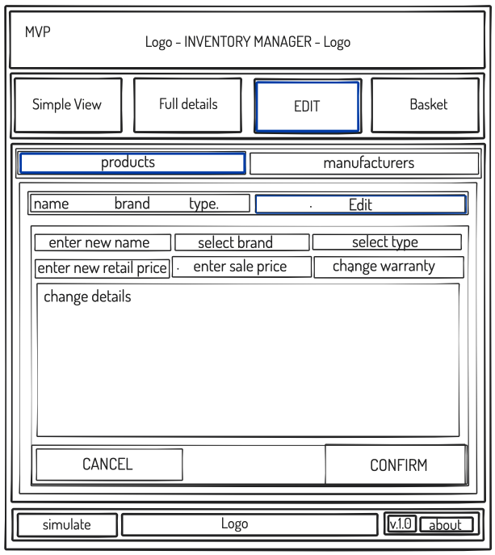

## Requirenemnts: 
1. Accepting that some things cannot be unseen.
2. Python3 installed - <code> ??  </code> in terminal
3. Flask installed - <code> pip3 Flask </code> in terminal
4. psycopg2 installed - <code> pip3 psycopg2 </code> in terminal

## To run this abomination you need to do the following: 
1. Go to root of the app:
2. In the terminal run code: <code> psql -d inventory -f db/inventory.sql </code>
3. In the terminal, run code: <code> python3 console.py </code>
- - you will need to quit from debug by typing in 'q' followed by ENTER key. 
4. In the terminal, run code: <code> flask run</code>
5. In your browser, go to: <code> localhost:5000 </code>
6. Achieve foetal position
7. Chant "Brace Brace" as yous way back and forth.

# Brief: 
## MVP:
- [x] Inventory should track individual <code>products</code> including their: name, description, stock quantity, buying cost and selling price
-[x] Should track manufacturers (<code>brand</code>), including: name and other details.
-[x] Edit <code>brand</code>s, and <code>product</code>s seperately
-[x] Create <code>brand</code>s, and <code>product</code>s seperately
-[x] Show and inventory page that lists all details for all products
-[x] Visually highlight LOW stock as well as OUT OF STOCK

## EXTENSIONS:
- [x] Added a basket feature that allows me to restock the products.

##  relations classes and tables

## Wireframe examples:

# Some learning outcomes:
- Reach out to others for help. the goal is to learn, not to know everything from the start.
- Doing wireframes is important! this was time consumin but it helped to point in a direction. 
- use thes to plan restful routes 
- - (I did not plan out the routes ahead of coding and it caused pain)

1. MARKDOWN Tips: 
- use backlash \\ to include underscores \_ in the markdown code format

2. Testing SETUP: 
- have the run_tests.py in the main project folder
- - have it import unitest, the classes/models with the file path
- - and the: 
<code>
 if \_\_name\_\_ == '\_\_main\_\_':   unittest.main() 
</code>
- - within each 
- class NameConvention(unittest.TestCase):
- def setUp(self):
- def test_the_name_of_test(seld):
- expected(to fail),expected(to pass), actual, self.assertEqual(expected,actual)

3. Repositories and CRUD:
- import run_sql from the relevant dir and the class from the location
- create CRUD functions initiating them with the sql = "", values = [ This is a list] ,results = sql(sql,values)

-- NOTE TO SELF!  ALWAYS USE   createdb database_name  in CONSOLE!  - to create the database before working on it
-- psql -d inventory -f db/inventory.sql in console to create the tables

CREATE
READ
UPDATE
DELETE

#SAVE
#SELECT ALL
#SELECT one using ID
#DELETE ALL
#DELETE one using ID
#UPDATE one using ID

FOR SELECT(ID)!!!: 
MAKE SURE to add * in the SELECT syntax!!!  - Would you believe me if I told you I wrote this a day prioir to being suck with this issue for hours???? 

4. CONTROLLERS AND HTML
use default 'html5' to autopopulate your base.html
use     the content from another file    to indicate where you will have the content form another file
use  with  put stuff here 

CSS IS EVIL

you cannot place a block in another block
also cannot have 2 blocks next to each other 
 
   will give error for calling same block more than once

 
 

ADDING BASKET: 

in stock.py - added basket variable to stock class
Inventory.psql - added basket to TABLE
stock repository - added basket variable throughtout the methods

FLASK - when you accidentally stop the process using CTRL+Z, resume by putting 'fg %1' in console

