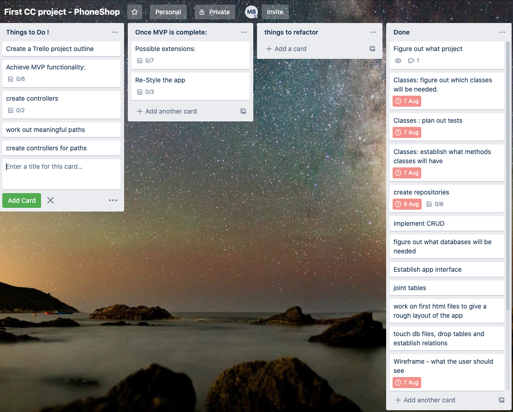
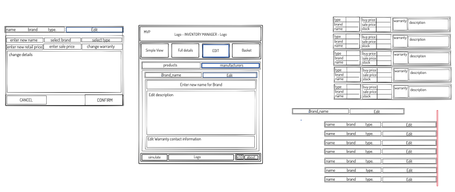
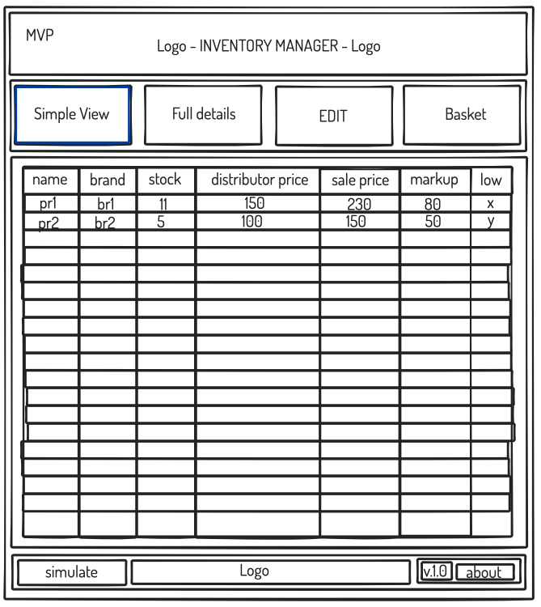
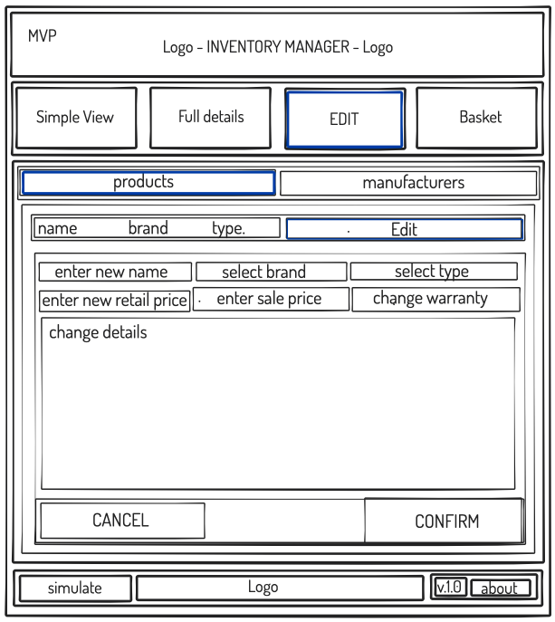
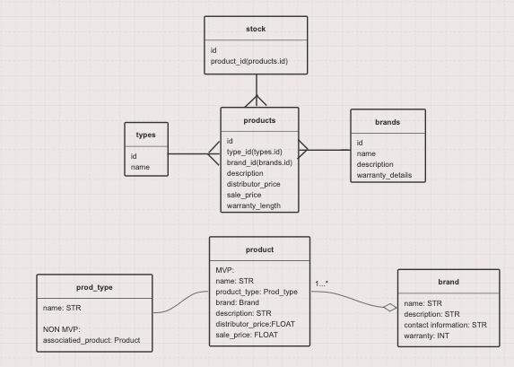
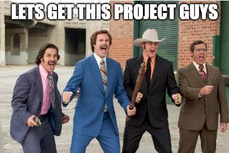

### [start](0.md) / [prev](0.md) / [next](2.md)
---
# 1. The planning:
## 1. Joined students who picked the same topic in a group chat so we could share the pain. 

## 2. Trello - Tried breaking up some tasks into smaller ones.

## 3.  I started with some wireframes on ziteboard: 

## 4. I worked on some relationship diagrams for classes and tables.

## 5. With Friday coming to an end we were hopeful and felt ready.

