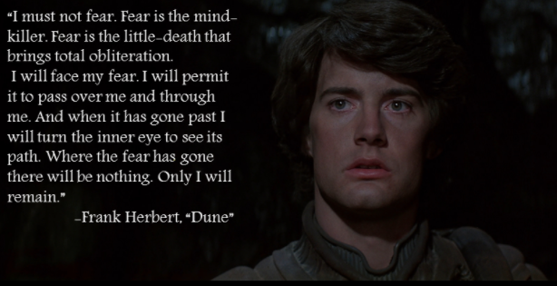
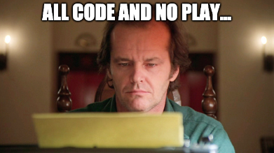

### [start](0.md) / [prev](1.md) / [next](3.md)
---
# Experience of working on the project: 

## 1. Yoda and Paul Atredis were onto something.
### Fear is the mind killer... and leads to suffering.

### Lack of sleep is also the mind killer.

## My own TRAPS: 
### Working despite being tired - I am making progress so I will take a break later.
##### ...and suddently I'm thirsty, hangry and restless. 
### Trying to figure things out by myself, with a "I should be able to do this" mindset.
### Not reaching out for help soon enough.
##### Lost a lot of time I could be prodcutive on scratching my brain.

## 2. Becoming aware of the problem is the first step of overcoming it. 
### I will aim to reach out to my supervisors and colleageues more frequently.
### I will aim to spend more time on planning.
### I realise I need to take breaks. 
### Try to remember that the <code> goal is to learn</code>, not to know everything from the start.

