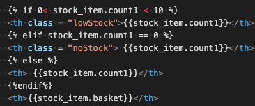
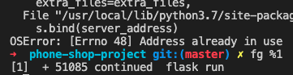

### [start](0.md) / [prev](2.md) / [next](4.md)
---
# Screen shots of stuff

# Coding and project management related outcomes:
## 1. PUT a * after SELECT when creating SQL logic to get all data out of a table.
### ..is also what I wrote somewhere in my project notes before loosing my mind on Monday.
## 2. IF statements in HTML! are sorcerry.

## 3. FLASK - when you accidentally stop the process using CTRL+Z, resume by putting 'fg %1' in console

#### I have closed VSCODE too many times just to be able to resume work.

## 4. Do not forget to plan out resful routes! I did. 
## 5. I should show my wireframe to my colleagues.
### this would have highlighted some of the missing features that I needed implement later.
## 6. Focus on MVP, keep the MVP targets always in front.
### avoid features (product type) that are not necessary for MVP until MVP is done.
#### or in the case of (product type), just skip.

## 7. Plan to PLAN. 